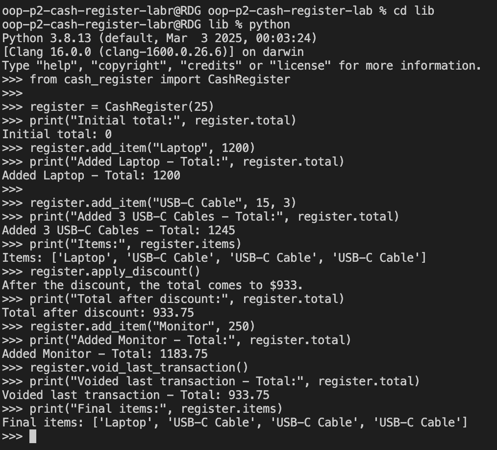

# Cash Register - OOP Lab (Part 2)

## Description

This project models real-world behavior of a register system used in e-commerce: adding items, applying discounts, and voiding transactions.

---

## Table of Contents

- [Demo](#demo)
- [Setup](#setup)
- [Usage](#usage)
- [Testing](#testing)
- [Features](#features)

---

## Demo

---

## Setup

1. Fork and clone the repo  
2. Create a virtual environment: `python3 -m venv .venv`
3. Activate virtual environment: 
  - Mac/Linux: `source .venv/bin/activate`  
  - Windows ` .venv\Scripts\activate`

---

## Testing
  - Install pytest: `pip install pytest`
  - Run the provided test file:  `pytest`

---

## Features
	•	add_item(item, price, quantity=1)
Adds one or multiple items to the register and updates the total.
	•	apply_discount()
Applies a percentage discount to the total price.
	•	void_last_transaction()
Removes the last transaction from the total and item list.
	•	@property and setter for discount
Ensures only valid discount values (integers between 0–100) are accepted.